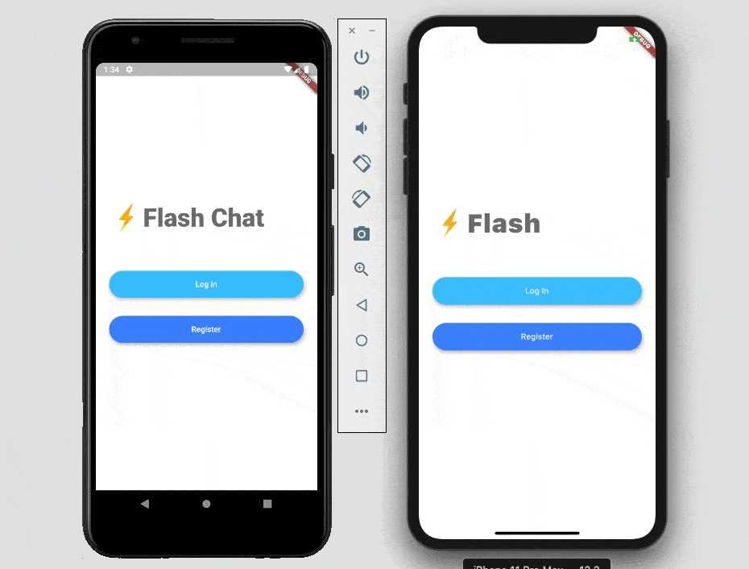
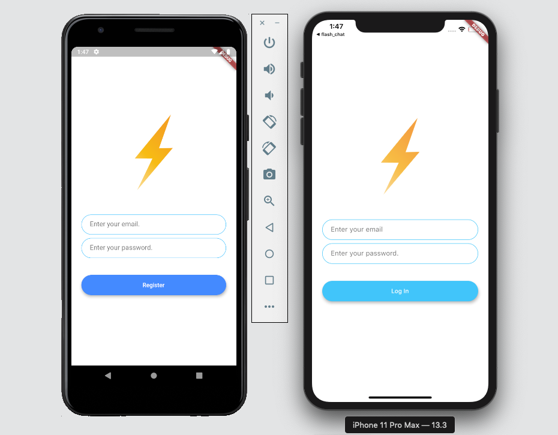

# Flash Chat ⚡️

A modern messaging app where users can sign up and log in to chat.

I used Firebase Cloud Firestore as well as the Firebase authentication package to equip the app with a cloud-based NoSQL database and secure authentication method. 

## Getting Started

Fork the project and run on your device

## Prerequisites

A prior knowledge of git 🙂

## What I learnt

- How to incorporate Firebase into your Flutter projects.
- How to use Firebase authentication to register and sign in users.
- How to create beautiful animations using the Flutter Hero widget.
- How to create custom aniamtions using Flutter's animation controller. 
- Learn all about mixins and how they differ from superclasses.
- Learn about Streams and how they work.
- Learn to use ListViews to build scrolling views.
- How to use Firebase Cloud Firestore to store and retrieve data on the fly.

## Screen shots

Welcome Screen

Login and Register screen

Chat Screen

## Acknowledgments

This is a companion project to The App Brewery's Complete App Development Bootcamp, check out the full course at [www.appbrewery.co](https://www.appbrewery.co/)

